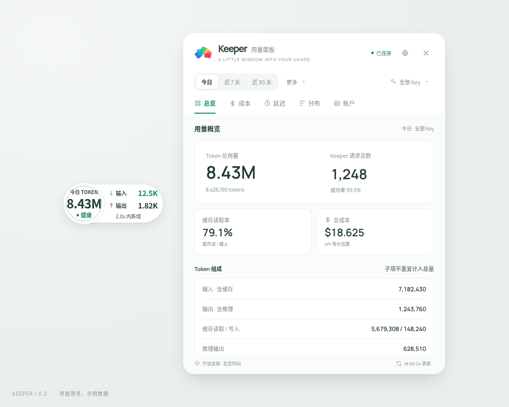
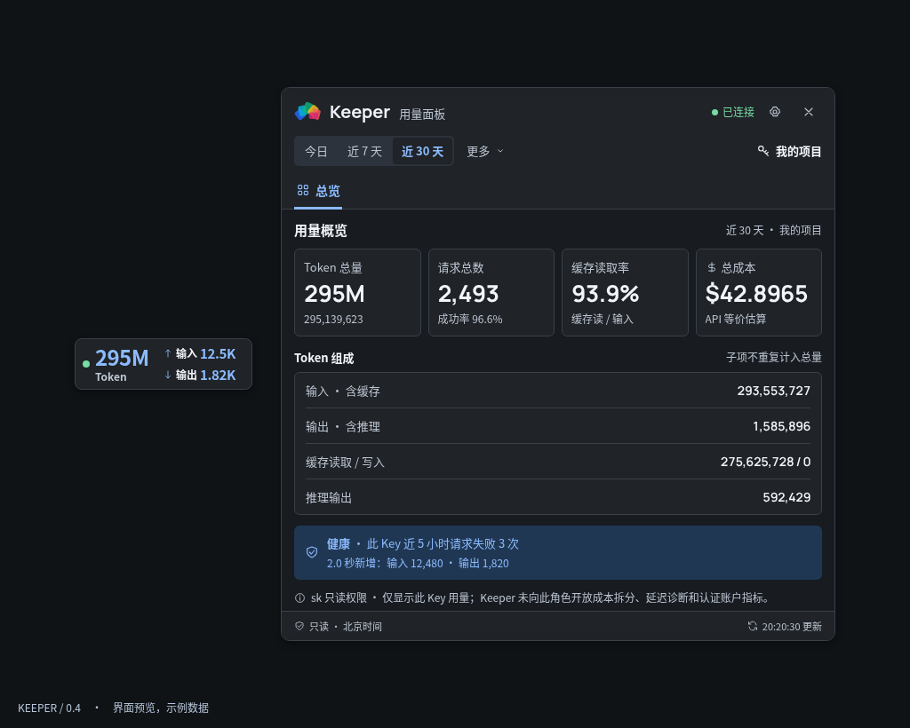
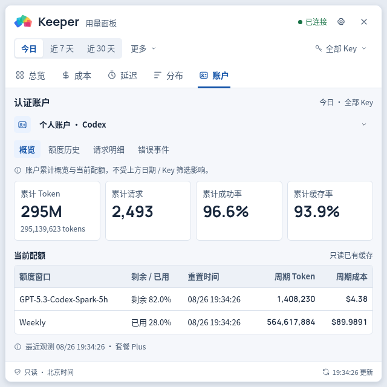
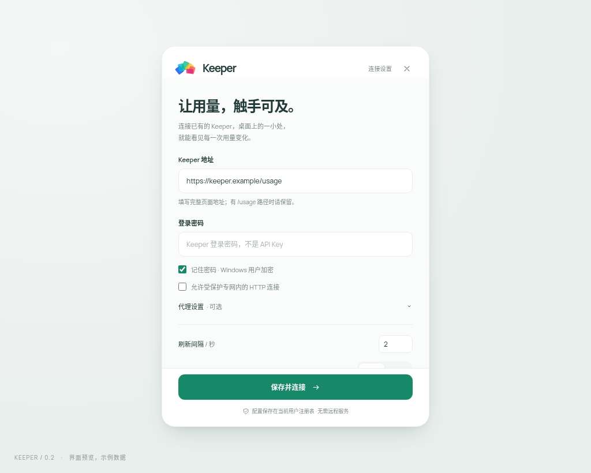

# Keeper UsagePanel

## 项目简介

Keeper UsagePanel 是面向 Windows 10 / 11 x64 的 [CPA Usage Keeper](https://github.com/Willxup/cpa-usage-keeper) 桌面用量面板。应用通过 Keeper API 读取数据，以置顶悬浮块和详情窗口展示 Token 用量、请求健康、成本及账户额度；无需额外部署适配服务，也不会启动本地 HTTP 服务。



## 功能特性

- **桌面悬浮监控**：置顶显示北京时间今日 Token 总量，以及最近采样区间的输入、输出增量；非零方向显示对应箭头，支持自定义非零数据保留时间、拖动、可关闭的屏幕左右外沿吸附收起（多屏衔接处可直接跨屏），并可在游戏、视频或无边框全屏时自动隐藏、退出全屏后恢复。
- **管理员总览**：支持今日、近 7 天、近 30 天和自定义日期范围，可查看全部 Key 或按 Key owner 筛选，并提供用量、成本、延迟、分布和认证账户信息。
- **状态与主题**：以健康状态点和文字结论展示连接及请求状态，支持浅色、深色主题、预设或自定义主题色和自定义悬浮窗字体。
- **自动更新**：启动后检查 GitHub Release，随后每小时检查；展示更新说明并支持稍后提醒、跳过版本及一键静默更新。安装版静默覆盖，便携版原位替换并重启；检查与下载沿用 Keeper 连接的代理和证书设置，安装前校验 SHA-256。
- **安全连接**：支持 Keeper 管理员密码或 API Key（sk）登录、HTTP/SOCKS5 代理；凭据和代理认证信息使用 Windows DPAPI 加密保存在当前用户配置中，连接失败时可复制脱敏 ERRLOG 排查代理、DNS、TLS 与超时问题。受信任内网代理使用未知 CA 时可显式关闭 HTTPS 证书验证，但建议优先安装内网 CA。
- **快捷入口**：可从详情窗口在系统默认浏览器中打开 Keeper 用量控制台和 CPA 控制台。

### API Key（sk）只读视图

sk 登录仅展示当前 Key 可访问的用量与健康数据，不开放管理员页签、其他 Key 的数据或 CPA 管理入口。



### 认证账户与额度

管理员可查看认证账户概览、当前额度、额度历史、请求明细和错误事件。额度数据只读取 Keeper 已有缓存，不会触发上游额度刷新。



### 连接设置

设置通过连接参数、外观与样式、悬浮窗行为三个标签页分页管理，可配置 Keeper 地址、登录方式、代理、刷新间隔、展示/隐藏行为、主题色和字体。管理员凭据、sk 与带认证信息的代理地址不会以明文保存。



## 项目依赖

| 项目                                                               | 用途                                                                   |
| ------------------------------------------------------------------ | ---------------------------------------------------------------------- |
| [CPA Usage Keeper](https://github.com/Willxup/cpa-usage-keeper)    | 本项目的直接数据源，负责持久化和聚合 CPA 用量，并提供统计与认证接口。  |
| [CLIProxyAPI（CPA）](https://github.com/router-for-me/CLIProxyAPI) | 产生模型请求和用量数据；Keeper 从 CPA 采集数据，本项目不直接连接 CPA。 |

使用前需要先部署并正确配置 CPA 与 Keeper，确保 Keeper 能够持续采集 CPA 用量。

## 如何使用

1. 从 [GitHub Releases](https://github.com/wlyzqm/Keeper-UsagePanel/releases/latest) 下载最新版。推荐使用 `KeeperUsagePanel_<版本>_x64-setup.exe`；已有 Microsoft WebView2 Runtime 时也可直接运行便携版 `KeeperUsagePanel.exe`。
2. 首次启动后填写完整的 Keeper 页面地址，例如 `https://keeper.example/usage`。
3. 选择“管理员密码”或“API Key（sk）”，输入凭据后保存并连接。
4. 悬停或点击悬浮块查看详情；右键悬浮块或使用系统托盘可打开设置、隐藏窗口或退出应用。

Keeper 应使用 `Asia/Shanghai` 时区，以保证“今日”数据与面板的北京时间口径一致。升级前请先退出旧版本；应用当前未做代码签名，Windows 首次运行时可能显示安全提示。

## 搭建开发环境

### 环境要求

- Windows 10 / 11 x64
- Node.js 24 与 npm
- Rust stable（`x86_64-pc-windows-msvc` 工具链）
- Microsoft C++ Build Tools，安装“使用 C++ 的桌面开发”、MSVC 和 Windows SDK
- Microsoft WebView2 Runtime

### 本地开发

```powershell
git clone https://github.com/wlyzqm/Keeper-UsagePanel.git
cd Keeper-UsagePanel
rustup default stable-x86_64-pc-windows-msvc
npm ci
npm run tauri dev
```

仅开发前端时运行 `npm run dev`，然后访问 `http://127.0.0.1:1420/?preview=1` 查看示例数据。可追加 `role=sk`、`theme=dark`、`window=settings` 等查询参数预览不同状态；预览模式不会连接真实 Keeper 或写入注册表。

### 测试与构建

```powershell
npm test
cargo test -p keeper-core --locked
npm run test:ui
npm run tauri build -- --target x86_64-pc-windows-msvc
```

构建产物位于 `target/x86_64-pc-windows-msvc/release/` 及其 `bundle/nsis/` 子目录。

## 鸣谢

感谢 [CPA Usage Keeper（Keeper）](https://github.com/Willxup/cpa-usage-keeper) 提供用量采集与统计能力，也感谢 [CLIProxyAPI（CPA）](https://github.com/router-for-me/CLIProxyAPI) 提供稳定的模型代理基础。

## 开源协议

本项目采用与 [CPA Usage Keeper](https://github.com/Willxup/cpa-usage-keeper/blob/main/LICENSE) 相同的 **MIT License**。你可以自由使用、复制、修改、合并、发布和分发本项目，但须保留原始版权与许可声明；软件按“原样”提供，不附带任何明示或默示担保。
